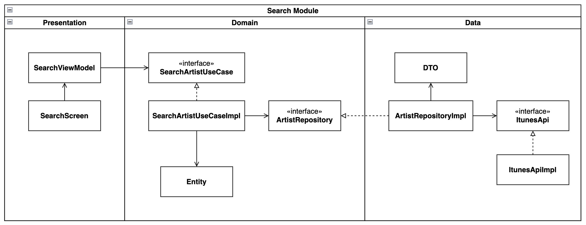

# Apple Music Search

- Nomadcoders Flutter 10주 Study에서 만든 졸업 작품
- iTunes Search API를 활용하여 Apple Music에서 artist를 검색하고, 해당 artist의 발매 앨범 및 앨범 수록곡들을 조회할 수 있다.
- API가 제공하는 30초짜리 sample audio를 재생해 볼 수 있다.

## Demo


## Packages

- flutter_riverpod
  - 이 app은 규모가 작고 여러 page에서 공유하는 상태가 거의 없으므로 상태 관리 라이브러리가 필요하지 않다.
  - Search page에서는 artist list 상태를 다른 page와 공유하지 않으므로 `ChangeNotifier`와 `ListenableBuilder`를 사용해서 MVVM pattern을 구현했다.
  - Album 및 song page에서는 학습 목적으로 riverpod package를 사용했다.
- flutter_animate : Animation을 간단하게 구현하기 위해 사용했다.
- freezed : Object의 value equality 구현을 위해 사용했다.
- json_annotation : JSON (de)serialization을 위한 `fromJson`, `toJson` code generation을 위해 사용했다.
- http : iTunes API GET request를 위해 사용했다.
- intl : Release date string을 formatting 하기 위해 사용했다.
- just_audio : iTunes API가 반환하는 sample audio url을 재생하기 위해 사용했다.

## What I Learned

### Architecture

Flutter app에 clean architecture를 적용해 보았다. 이 app 에서는 **Data**, **Domain**, **Presentation** 3개 layer로 분리하는 3-layer architecture를 적용했다.

|                Search Module 예시                 |
| :-----------------------------------------------: |
|  |

- Data layer
  - Network : `iTunesApi`, `iTunesApiReslut`
  - Repository implementations : `ArtistRepositoryImpl`, `AlbumRepositoryImpl`
  - DTO : `ArtistDto`, `AlbumDto`, `SongDto`
- Domain layer
  - Entity : `Artist`, `Album`, `Song`
  - Use case : `SearchArtistUseCase(Impl)`, `FetchAlbumUseCase(Impl)`
  - Repository interface : `ArtistRepository`, `AlbumRepository`
- Presentation layer
  - View : `SearchScreen`, `AlbumScreen`, `SongsScreen`
  - ViewModel : `SearchViewModel`, `AlbumViewModel`, `SongsViewModel`
  - 기타 UI 관련 : `ReleaseDateFormatter`, `SampleAudioPlayer`

Dart에서 interface로 사용할 class의 modifier를 어떻게 사용해야 할지 고민이 됐다. Interface는 아래 조건을 만족해야 한다.

1. Instance를 생성할 수 없다.
2. Interface에서 정의한 method를 구현체가 반드시 구현해야 한다.

`abstract` class modifier는 이 조건에 부합하는 modifieir이다. 하지만, `abstract`는 확장(`extends`)과 구현(`implements`) 둘 다 가능한데, abstract method에 구현부를 추가하면 확장하는 경우에는 subtype이 method 구현부를 상속받으므로 override하지 않아도 문제가 없다.

개발자의 실수를 compile-time에 방지하고 용도를 더 명확하게 나타낼 수 있도록 `interface` modifier를 조합해서 사용할 수도 있다. `interface`는 instance 생성은 허용하지만 확장을 통한 상속을 제한하므로, 두 modifier를 묶어서 `abstract interface`로 사용하면 override를 compile-time에 강제할 수 있다.

```dart
abstract interface class Repository {
  Future fetchData() {
    print("Fetch data");
  }
}

final repository = Repository(); // abstract가 intance 생성을 제한한다.

class RepositoryImpl extends Repository {} // ❌ : interface가 확장을 제한하여 상속 가능성을 제거한다.

class RepositoryImpl implements Repository { // abstract와 interface 모두 구현을 허용한다.

  // 반드시 구현을 추가하도록 강제한다.
  @override
  Future fetchData() {
    // API request
  }
}
```

그런데 `abstract interface`도 사실 완벽한 방법은 아니다. Dart의 class modifier들은 확장과 구현 관계에 대해 같은 file 안에서는 제한을 두지 않기 때문이다. File 개수가 많아지는 것을 피하려고 interface와 구현체를 하나의 file에 작성한다면 2번을 강제할 방법은 없다. 따라서, 간단하게 `abstract` modifier 하나만 사용하고 abstract method에 직접 구현부를 작성하지 않도록 신경쓰는 것도 좋은 방법이다.

Swift에서는 `protocol`을 사용해서 interface를 구현하는데, 이 때는 위의 두 가지 조건을 쉽게 만족할 수 있었다. `protocol` 자체가 instance를 생성할 수 있는 class가 아니고, `protocol`에 정의한 method들은 반드시 상속받은 class에서 구현을 추가해야 하기 때문이다. Swift를 사용하던 경험과 비교했을 때, Dart 언어는 class modifier가 과하게 파편화 되어 있다는 점과 확장 및 구현에 대한 제한이 다른 file에 대해서만 적용된다는 점이 아쉬운 것 같다.

### Riverpod

Riverpod provider와 관련해서 의존성 주입에 어려움이 있었다. 지금까지는 객체를 provider에서 직접 생성해서 반환해왔는데, 의존성을 주입하는 일은 조금 까다로웠다.

일반적인 방법으로 외부 의존성을 주입하려면 `main` 함수(또는 composition root)에서 의존성 객체를 생성한 뒤 `ProviderScope.overrides`에서 provider를 override하는 과정이 필요하다. 이 방법은 provider를 정의하는 부분에서 반환할 initial 값이 불분명하고 임의의 장소에서 동작이 override 되도록 구현하는 것은 예상치 못한 버그를 만들기 쉬워 보였다.

```dart
// Definition
final provider = Provider(
  (ref) => throw UnimplementedError(),
);

...

// Overrides in somewhere (maybe in the main function)
void main() {
  ...

  final dependency = MyDependency();
  runApp(
    ProviderScope(
      overrides: [
        provider.overrideWith(
          // 여기서 다른 객체가 반환된다는 사실을 모른 채 provider의 선언부를 수정한다면? 🤔
          () => MyObject(dependency: dependency),
        ),
      ],
      child: const MyApp(),
    ),
  );
}
```

Override를 하지 않기 위해 의존성으로 주입하려는 객체들에 대한 [`Provider`들을 모아두는 file](./lib/layer/presentation/provider/)을 별도로 사용했다. 일반적으로 class를 선언한 file에서 provider도 함께 선언하지만, app 또는 widget의 공유 상태를 관리하는 "상태 관리"라는 riverpod의 목적에 미루어 볼 때 architecture의 가장 바깥 layer인 presentation layer 안에서만 riverpod에 의존하는 것이 적절하다고 생각했다.

### Text marquee animation

- Song list에서 title이 길어서 잘리는 곡을 재생할 때, song title에 marquee animation을 구현했다.
- 구현 과정
  1. `TextPainter`를 사용하여 text width 계산
  2. `LayoutBuilder`를 사용하여 song title 영역의 max width를 얻음
  3. Text width가 max width보다 큰 경우 animation 재생
- Marquee animation 구현
  1. Song title 두 개를 이어붙여서 긴 text 생성
  2. Text width만큼 X축 translation animation 실행
  3. Animation이 끝나면 처음부터 다시 시작하며 무한 반복
- [소스 코드](./lib/layer/presentation/view/album/widgets/song/song_list_item.dart)
